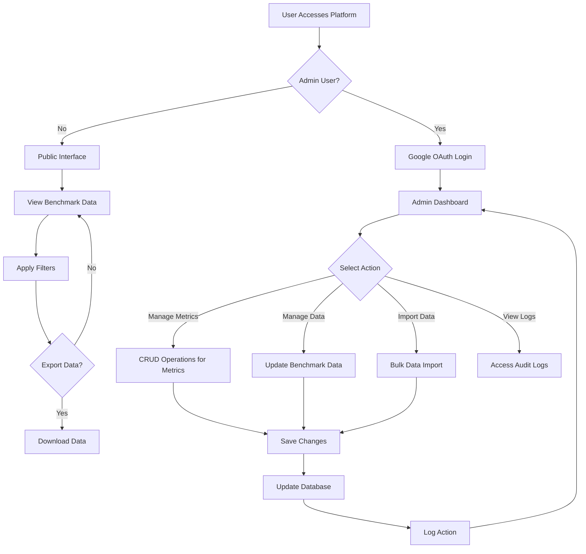
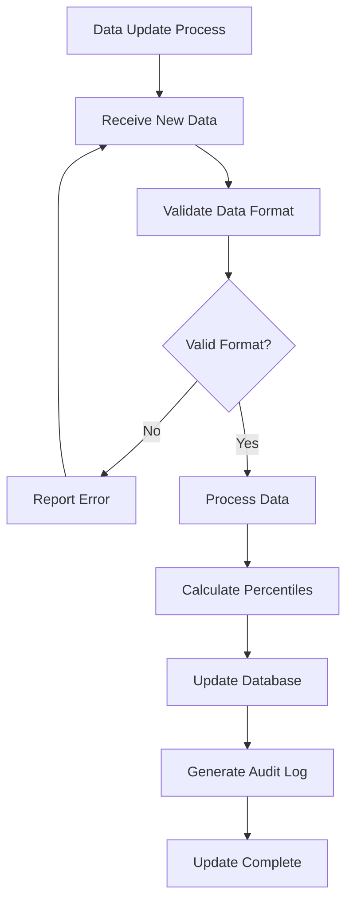
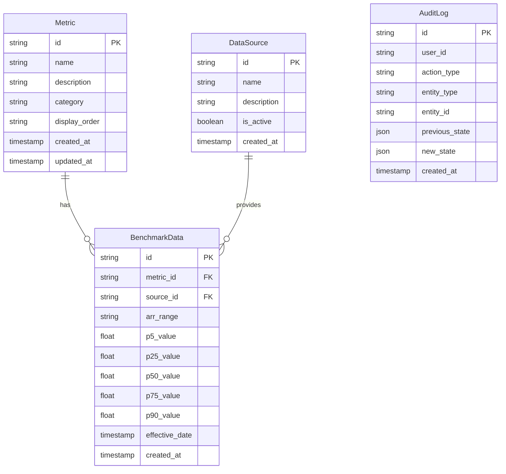
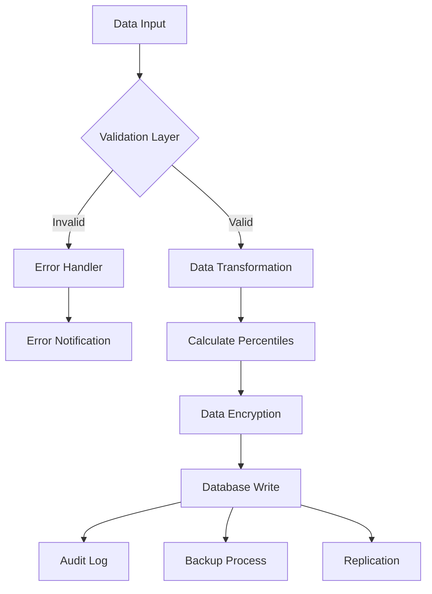
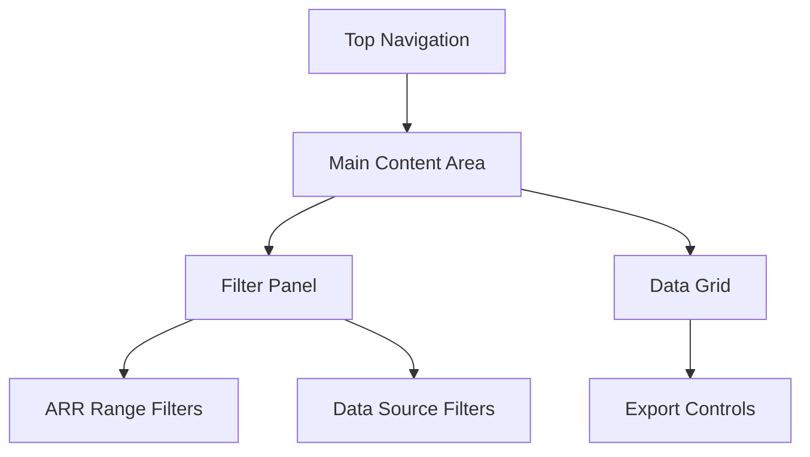

# Product Requirements Document (PRD)

# 1. INTRODUCTION

## 1.1 Purpose

This Product Requirements Document (PRD) specifies the functional and non-functional requirements for a SaaS Benchmarks Platform. The document serves as a comprehensive guide for developers, project managers, stakeholders, and quality assurance teams involved in the development and deployment of the platform.

## 1.2 Scope

The SaaS Benchmarks Platform is a web-based solution designed to provide comprehensive benchmark data for key SaaS metrics. The platform will:

- Present benchmark data across 14 essential SaaS KPIs including financial, operational, and growth metrics
- Enable data filtering by Annual Recurring Revenue (ARR) ranges and data sources
- Display statistical distributions (5th to 90th percentiles) for each metric
- Provide a public-facing interface for data consumption
- Include an administrative backend for data management and maintenance
- Support data export capabilities
- Ensure secure access control for administrative functions

Key benefits include:

- Centralized access to SaaS industry performance metrics
- Data-driven decision making for SaaS companies
- Flexible filtering for relevant peer group comparison
- Secure and maintainable platform for benchmark data management

The platform explicitly excludes:

- Raw data storage of individual company metrics
- Real-time data integration with external systems
- Predictive analytics or forecasting capabilities
- User account management for public access to the front but to the back is neccesary as only admins can edit data

# 2. PRODUCT DESCRIPTION

## 2.1 Product Perspective

The SaaS Benchmarks Platform operates as a standalone web-based system that serves as a centralized repository for SaaS industry performance metrics. The platform interfaces with:

- Google OAuth 2.0 for administrative authentication
- Web browsers for public data consumption
- Backend database for benchmark data storage
- Export systems for data extraction to common formats

## 2.2 Product Functions

The platform provides the following core functions:

- Display of benchmark data across 14 SaaS KPIs with statistical distributions
- Interactive filtering by ARR ranges and data sources
- Data visualization through responsive tables and percentile displays
- Administrative interface for benchmark data management including:
  - CRUD operations for metrics, data sources, and benchmark values
  - Bulk data import capabilities
  - Audit logging of administrative actions
- Data export functionality for filtered datasets

## 2.3 User Characteristics

### Public Users

- SaaS company executives and decision-makers
- Financial analysts and investors
- Industry researchers and consultants
- Expected technical proficiency: Basic understanding of SaaS metrics and web interfaces
- Primary goal: Access to relevant benchmark data for comparison and analysis

### Administrative Users

- Platform administrators
- Data managers
- Technical proficiency: Intermediate to advanced
- Responsibilities: Data maintenance, quality control, and platform management

## 2.4 Constraints

- Technical Constraints:
  - Must operate on modern web browsers (Chrome, Firefox, Safari, Edge)
  - Response time for data filtering \< 2 seconds
  - Export file size limited to 10MB
- Security Constraints:
  - Admin access restricted to authorized Google accounts
  - No storage of individual company data
  - Compliance with data privacy regulations
- Operational Constraints:
  - Regular data updates required for relevance
  - Limited to predefined ARR ranges and metrics

## 2.5 Assumptions and Dependencies

### Assumptions

- Users have internet access and modern web browsers
- Benchmark data sources remain available and reliable
- Statistical distributions (5th to 90th percentile) provide sufficient insight
- Public access doesn't require user authentication

### Dependencies

- Google OAuth 2.0 service availability
- Data source partnerships and agreements
- Web hosting and database services
- Modern browser support for interactive features
- Regular data updates from industry sources

# 3. PROCESS FLOWCHART





# 4. FUNCTIONAL REQUIREMENTS

## 4.1 Public Interface Features

### F1: Benchmark Data Display

**ID**: F1  
**Description**: Display benchmark data for 14 SaaS KPIs with statistical distributions  
**Priority**: High

| Requirement ID | Requirement Description |
| --- | --- |
| F1.1 | Display metrics in an interactive table format |
| F1.2 | Show 5th, 25th, 50th, 75th, and 90th percentiles for each metric |
| F1.3 | Include metric definitions and tooltips |
| F1.4 | Support responsive design for various screen sizes |
| F1.5 | Update displayed data dynamically based on selected filters |

### F2: Data Filtering

**ID**: F2  
**Description**: Enable users to filter benchmark data by ARR ranges and data sources  
**Priority**: High

| Requirement ID | Requirement Description |
| --- | --- |
| F2.1 | Implement ARR range filters (\<$1M, $1M-$5M, $5M-$20M, $20M-$50M, \>$50M) |
| F2.2 | Allow data source selection |
| F2.3 | Support multiple simultaneous filter selections |
| F2.4 | Maintain filter state during session |
| F2.5 | Display currently active filters |

### F3: Data Export

**ID**: F3  
**Description**: Enable export of filtered benchmark data  
**Priority**: Medium

| Requirement ID | Requirement Description |
| --- | --- |
| F3.1 | Support CSV format export |
| F3.2 | Include all visible metrics and percentiles in export |
| F3.3 | Limit export file size to 10MB |
| F3.4 | Include export timestamp and filter parameters |

F4. be able to run multiple searches meaning i oculd search for one metric for a given revenue range and source and then reset and do a new search

## 4.2 Administrative Features

### F4: Authentication

**ID**: F4  
**Description**: Secure admin access using Google OAuth 2.0  
**Priority**: High

| Requirement ID | Requirement Description |
| --- | --- |
| F4.1 | Implement Google OAuth 2.0 login |
| F4.2 | Maintain secure session management |
| F4.3 | Support admin role authorization |
| F4.4 | Enable session timeout after 30 minutes of inactivity |

### F5: Metrics Management

**ID**: F5  
**Description**: CRUD operations for SaaS metrics  
**Priority**: High

| Requirement ID | Requirement Description |
| --- | --- |
| F5.1 | Create new metrics with definitions |
| F5.2 | Edit existing metric properties |
| F5.3 | Delete metrics (with safeguards) |
| F5.4 | Manage metric display order |
| F5.5 | Support metric categorization |

### F6: Benchmark Data Management

**ID**: F6  
**Description**: Tools for managing benchmark data values  
**Priority**: High

| Requirement ID | Requirement Description |
| --- | --- |
| F6.1 | Support bulk data import via CSV |
| F6.2 | Validate data format and values |
| F6.3 | Update individual benchmark values |
| F6.4 | Maintain data version history |
| F6.5 | Generate data update notifications |

### F7: Audit Logging

**ID**: F7  
**Description**: Track all administrative actions  
**Priority**: Medium

| Requirement ID | Requirement Description |
| --- | --- |
| F7.1 | Log all data modifications |
| F7.2 | Record user actions with timestamps |
| F7.3 | Store previous values for changed data |
| F7.4 | Enable audit log filtering and search |
| F7.5 | Support audit log export |

# 5. NON-FUNCTIONAL REQUIREMENTS

## 5.1 Performance Requirements

| Requirement | Description | Target Metric |
| --- | --- | --- |
| Response Time | Maximum time for data filtering and display | \< 2 seconds |
| Page Load Time | Initial page load performance | \< 3 seconds |
| API Response | Backend API response time | \< 500ms |
| Concurrent Users | Number of simultaneous users supported | 1000+ |
| Database Query | Maximum query execution time | \< 1 second |
| Export Generation | Time to generate and start download | \< 5 seconds |
| Resource Usage | Maximum server CPU utilization | \< 70% |
| Memory Usage | Maximum application memory usage | \< 2GB |

## 5.2 Safety Requirements

| Requirement | Description |
| --- | --- |
| Data Backup | Daily automated backups with 30-day retention |
| Failover | Automatic failover to backup systems within 5 minutes |
| Data Recovery | Recovery Point Objective (RPO) of 24 hours |
| System Recovery | Recovery Time Objective (RTO) of 4 hours |
| Error Handling | Graceful degradation of services during partial system failure |
| Data Validation | Input validation for all data entry points |
| Audit Trail | Comprehensive logging of system failures and recoveries |

## 5.3 Security Requirements

| Requirement | Description |
| --- | --- |
| Authentication | Google OAuth 2.0 for admin access |
| Authorization | Role-based access control (RBAC) for administrative functions |
| Data Encryption | TLS 1.3 for data in transit |
| Database Security | AES-256 encryption for sensitive data at rest |
| Session Management | 30-minute timeout for inactive admin sessions |
| Access Control | IP whitelisting for administrative access |
| Security Headers | Implementation of HSTS, CSP, and XSS protection headers |
| Audit Logging | Detailed logging of all security events and access attempts |

## 5.4 Quality Requirements

### 5.4.1 Availability

- System uptime: 99.9% (excluding planned maintenance)
- Planned maintenance windows: Monthly, off-peak hours
- Maximum unplanned downtime: 43 minutes per month

### 5.4.2 Maintainability

- Modular architecture for easy component updates
- Comprehensive API documentation
- Automated deployment pipeline
- Code coverage minimum: 80%
- Regular dependency updates schedule

### 5.4.3 Usability

- Mobile-responsive design
- WCAG 2.1 Level AA compliance
- Maximum of 3 clicks to access any feature
- Consistent UI/UX patterns
- Help documentation and tooltips

### 5.4.4 Scalability

- Horizontal scaling capability
- Auto-scaling based on load
- Database partitioning support
- CDN integration for static assets
- Microservices architecture support

### 5.4.5 Reliability

- Mean Time Between Failures (MTBF): 720 hours
- Mean Time To Recovery (MTTR): \< 4 hours
- Error rate: \< 0.1% of all requests
- Data consistency check mechanisms
- Automated monitoring and alerting

## 5.5 Compliance Requirements

| Requirement | Description |
| --- | --- |
| Data Privacy | GDPR and CCPA compliance for data handling |
| Accessibility | WCAG 2.1 Level AA compliance |
| Security Standards | SOC 2 Type II compliance |
| Browser Support | Support for latest versions of Chrome, Firefox, Safari, and Edge |
| Data Retention | Compliance with industry-standard data retention policies |
| Documentation | Maintenance of compliance documentation and certifications |
| Reporting | Regular compliance audit reports and assessments |
| Third-party Code | License compliance for all third-party components |

# 6. DATA REQUIREMENTS

## 6.1 Data Models



## 6.2 Data Storage

### 6.2.1 Database Requirements

- Primary database: PostgreSQL 14+ for structured data storage
- Read replicas: Minimum 2 replicas for load distribution
- Connection pooling with maximum 100 concurrent connections
- Automated schema migrations with version control

### 6.2.2 Data Retention

- Benchmark data: Indefinite retention with archival after 5 years
- Audit logs: 2-year retention with archival
- Session data: 30-day retention
- Backup data: 90-day retention

### 6.2.3 Backup and Recovery

- Daily full database backups
- Point-in-time recovery capability for last 30 days
- Cross-region backup replication
- Maximum backup size: 100GB
- Recovery time objective (RTO): 4 hours
- Recovery point objective (RPO): 24 hours

### 6.2.4 Data Redundancy

- Geographic redundancy across 3 regions
- Synchronous replication for primary database
- Asynchronous replication for read replicas
- Hot standby configuration for failover

## 6.3 Data Processing



### 6.3.1 Data Security

- Encryption at rest using AES-256
- TLS 1.3 for data in transit
- Column-level encryption for sensitive fields
- Data masking for non-production environments
- Access control lists (ACL) for data access
- Regular security audits and penetration testing

### 6.3.2 Data Validation

- Schema validation for all incoming data
- Business rule validation for metric values
- Range checks for percentile values (0-100)
- Referential integrity enforcement
- Duplicate detection and handling

### 6.3.3 Data Transformation

- Standardization of metric values
- Percentile calculation for benchmark data
- Currency normalization to USD
- Date/time standardization to UTC
- Automated data cleansing routines

### 6.3.4 Data Integration

- Bulk import support for CSV files
- API endpoints for data ingestion
- Error handling and validation reporting
- Transaction management for data consistency
- Rate limiting for API endpoints

# 7. EXTERNAL INTERFACES

## 7.1 User Interfaces

### 7.1.1 Public Interface

| Component | Description |
| --- | --- |
| Navigation | Fixed top navigation bar with logo and main menu items |
| Filter Panel | Left-aligned panel with collapsible sections for ARR ranges and data sources |
| Data Grid | Responsive table displaying metrics and percentile distributions |
| Export Controls | Download button with format selection dropdown |
| Help Elements | Context-sensitive tooltips and metric definitions |



### 7.1.2 Administrative Interface

| Component | Description |
| --- | --- |
| Admin Dashboard | Grid layout with key management sections |
| Data Management | CRUD interfaces for metrics and benchmark data |
| Import Wizard | Step-by-step interface for bulk data imports |
| Audit Log Viewer | Searchable table with filtering capabilities |
| System Status | Real-time monitoring dashboard |

## 7.2 Software Interfaces

| Interface | Description | Protocol | Data Format |
| --- | --- | --- | --- |
| Google OAuth 2.0 | Authentication service | HTTPS | JSON/JWT |
| PostgreSQL | Primary database | TCP/IP | SQL |
| Redis | Session management and caching | TCP/IP | Binary |
| CDN | Static asset delivery | HTTPS | Various |
| Export Service | Data export generation | Internal API | CSV |

## 7.3 Communication Interfaces

| Interface Type | Specification |
| --- | --- |
| HTTP/HTTPS | TLS 1.3 for all communications |
| API Protocol | RESTful APIs with JSON payload |
| WebSocket | Real-time updates for admin dashboard |
| Database Protocol | PostgreSQL wire protocol |
| Cache Protocol | Redis RESP protocol |

### 7.3.1 API Endpoints

| Endpoint | Method | Purpose |
| --- | --- | --- |
| /api/v1/metrics | GET, POST, PUT, DELETE | Metric management |
| /api/v1/benchmarks | GET, POST, PUT, DELETE | Benchmark data operations |
| /api/v1/sources | GET, POST, PUT, DELETE | Data source management |
| /api/v1/export | POST | Data export generation |
| /api/v1/audit | GET | Audit log access |

### 7.3.2 Data Formats

```json
{
  "metric": {
    "id": "string",
    "name": "string",
    "description": "string",
    "category": "string",
    "percentiles": {
      "p5": "number",
      "p25": "number",
      "p50": "number",
      "p75": "number",
      "p90": "number"
    }
  }
}
```

# 8. APPENDICES

## 8.1 GLOSSARY

| Term | Definition |
| --- | --- |
| Annual Recurring Revenue (ARR) | The yearly value of subscription contracts normalized to a 12-month period |
| Gross Margin | The percentage of revenue remaining after accounting for direct costs of delivering the service |
| Net Dollar Retention (NDR) | Measure of revenue changes from existing customers including expansions, contractions, and churn |
| Gross Retention | Percentage of recurring revenue retained from existing customers, excluding expansions |
| Pipeline Coverage | Ratio of sales pipeline to revenue target |
| Magic Number | Efficiency metric calculated as net new ARR divided by sales and marketing spend |
| Payback Period | Time required to recover customer acquisition cost through gross margin |
| EBITDA Margin | Earnings Before Interest, Taxes, Depreciation, and Amortization as a percentage of revenue |
| NTM Revenue Multiple | Next Twelve Months revenue multiple used for company valuation |

## 8.2 ACRONYMS

| Acronym | Expansion |
| --- | --- |
| API | Application Programming Interface |
| ARR | Annual Recurring Revenue |
| CDN | Content Delivery Network |
| CRUD | Create, Read, Update, Delete |
| CSP | Content Security Policy |
| EBITDA | Earnings Before Interest, Taxes, Depreciation, and Amortization |
| G&A | General and Administrative |
| HSTS | HTTP Strict Transport Security |
| KPI | Key Performance Indicator |
| MTBF | Mean Time Between Failures |
| MTTR | Mean Time To Recovery |
| NDR | Net Dollar Retention |
| NTM | Next Twelve Months |
| RBAC | Role-Based Access Control |
| R&D | Research and Development |
| RPO | Recovery Point Objective |
| RTO | Recovery Time Objective |
| SaaS | Software as a Service |
| TLS | Transport Layer Security |
| UI/UX | User Interface/User Experience |
| UTC | Coordinated Universal Time |
| WCAG | Web Content Accessibility Guidelines |
| XSS | Cross-Site Scripting |

## 8.3 ADDITIONAL REFERENCES

| Reference | Description | URL |
| --- | --- | --- |
| Google OAuth 2.0 Documentation | Authentication implementation guide | https://developers.google.com/identity/protocols/oauth2 |
| PostgreSQL Documentation | Database technical reference | https://www.postgresql.org/docs/ |
| WCAG 2.1 Guidelines | Web accessibility standards | https://www.w3.org/WAI/WCAG21/quickref/ |
| Redis Documentation | Caching system reference | https://redis.io/documentation |
| SaaS Metrics Guide | Detailed definitions of SaaS KPIs | https://www.saas-capital.com/resources/saas-metrics-guide |