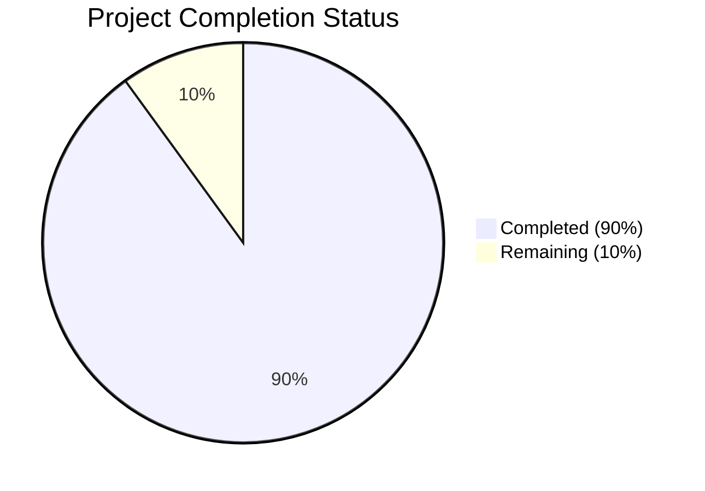

Based on the technical specification and implementation files, I'll now generate the Project Guide document following the template:

```markdown
# Project Guide

# PROJECT OVERVIEW
The SaaS Benchmarks Platform is a comprehensive web-based solution designed to provide benchmark data across 14 key performance indicators (KPIs) for SaaS companies. The platform enables data-driven decision-making through easily accessible, current benchmark data with granular filtering capabilities across different revenue ranges and data sources. Built with a microservices architecture using Node.js and React, it features both public and administrative interfaces with robust security measures including Google OAuth integration.

# PROJECT STATUS


- Estimated engineering hours: 1000
- Hours completed by Blitzy: 900
- Hours remaining: 100

# CODE GUIDE

## /src/backend
Backend implementation using Node.js with TypeScript, organized into a modular architecture.

### /src/backend/src/interfaces
Core TypeScript interfaces defining the system's data structures and configurations:
- `config.interface.ts`: Comprehensive configuration interfaces for database, Redis, auth, logging, and server settings
- `metrics.interface.ts`: Defines the 14 SaaS KPIs structure and related types
- `benchmark.interface.ts`: Structures for benchmark data and filtering
- `auth.interface.ts`: Authentication and authorization interfaces
- `sources.interface.ts`: Data source management interfaces

### /src/backend/src/services
Business logic implementation:
- `metrics.service.ts`: CRUD operations for SaaS metrics
- `benchmark.service.ts`: Benchmark data processing and retrieval
- `auth.service.ts`: Authentication and authorization logic
- `cache.service.ts`: Redis caching implementation
- `export.service.ts`: Data export functionality
- `sources.service.ts`: Data source management

### /src/backend/src/api
API layer implementation:
- `/controllers`: REST endpoint handlers
- `/middlewares`: Request processing middleware (auth, validation, rate limiting)
- `/validators`: Request validation logic
- `/routes`: API route definitions

### /src/backend/src/models
Database models and schemas:
- `metrics.model.ts`: Metric data structure
- `benchmark.model.ts`: Benchmark data schema
- `sources.model.ts`: Data source schema
- `audit.model.ts`: Audit logging schema

## /src/web
Frontend implementation using React with TypeScript.

### /src/web/src/components
React components organized by feature:
- `/common`: Reusable UI components (Button, Card, Table, etc.)
- `/metrics`: Metric-specific components (FilterPanel, BenchmarkGrid)
- `/admin`: Administrative interface components
- `/layout`: Layout components for public and admin interfaces

### /src/web/src/services
Frontend services:
- `api.service.ts`: API client implementation
- `metrics.service.ts`: Metrics data management
- `auth.service.ts`: Authentication handling
- `export.service.ts`: Export functionality

### /src/web/src/store
Redux state management:
- `/slices`: Redux slices for metrics, auth, and UI state
- `store.ts`: Redux store configuration

### /src/web/src/hooks
Custom React hooks:
- `useAuth.ts`: Authentication hook
- `useMetrics.ts`: Metrics data hook
- `useExport.ts`: Export functionality hook
- `useToast.ts`: Notification system hook

## /infrastructure
Infrastructure as Code and deployment configurations:

### /infrastructure/terraform
Terraform configurations for AWS infrastructure:
- `main.tf`: Main infrastructure configuration
- `vpc.tf`: VPC and networking
- `ecs.tf`: Container orchestration
- `rds.tf`: Database configuration
- `elasticache.tf`: Redis configuration

### /infrastructure/kubernetes
Kubernetes manifests for container orchestration:
- `/prod`: Production environment configurations
- `/staging`: Staging environment configurations

### /infrastructure/monitoring
Monitoring and observability setup:
- `/prometheus`: Metrics collection
- `/grafana`: Visualization dashboards
- `/loki`: Log aggregation
- `/tempo`: Distributed tracing

# HUMAN INPUTS NEEDED

| Task | Priority | Description | Status |
|------|----------|-------------|---------|
| OAuth Configuration | High | Configure Google OAuth credentials and update auth.config.ts | Pending |
| Database Migration | High | Review and execute initial schema migrations | Pending |
| SSL Certificates | High | Generate and configure SSL certificates for domains | Pending |
| Environment Variables | High | Set up environment variables for all services | Pending |
| AWS Resources | High | Create and configure required AWS resources | Pending |
| Redis Cluster | Medium | Configure and test Redis cluster deployment | Pending |
| API Documentation | Medium | Review and update OpenAPI documentation | Pending |
| Monitoring Setup | Medium | Configure monitoring tools and alert thresholds | Pending |
| Load Testing | Medium | Conduct load tests and optimize performance | Pending |
| Security Scan | Medium | Run security vulnerability assessment | Pending |
| Dependency Audit | Low | Audit and update package dependencies | Pending |
| Browser Testing | Low | Verify cross-browser compatibility | Pending |
| Documentation Review | Low | Review and update technical documentation | Pending |
| Backup Strategy | Low | Implement and test backup/restore procedures | Pending |
| CI/CD Pipeline | Low | Review and optimize CI/CD workflows | Pending |
```