# Technical Specifications

# 1. INTRODUCTION

## 1.1 EXECUTIVE SUMMARY

The SaaS Benchmarks Platform is a web-based solution designed to provide comprehensive benchmark data across 14 key performance indicators (KPIs) for SaaS companies. The platform addresses the critical need for reliable, segmented performance metrics by offering filterable benchmark data across different revenue ranges and data sources. Primary users include SaaS executives, financial analysts, and industry researchers, with administrative capabilities restricted to authorized platform managers.

The platform will enable data-driven decision-making through easily accessible, current benchmark data while maintaining high security standards and efficient data management capabilities through a dedicated administrative interface.

## 1.2 SYSTEM OVERVIEW

### Project Context

| Aspect | Description |
|--------|-------------|
| Business Context | First-of-its-kind centralized platform for SaaS benchmark data with granular filtering capabilities |
| Market Position | Independent benchmark data provider focusing on SaaS industry metrics |
| Integration Landscape | Standalone system with Google OAuth integration for admin access |

### High-Level Description

| Component | Details |
|-----------|----------|
| Public Interface | Responsive web platform for benchmark data access and filtering |
| Admin Backend | Secure administrative interface for data management and maintenance |
| Data Management | Centralized storage with support for multiple data sources and ARR ranges |
| Security Layer | OAuth-based authentication and role-based access control |

### Success Criteria

| Criterion | Target Metric |
|-----------|--------------|
| System Performance | < 2 second response time for data filtering |
| Data Accuracy | 100% validation of imported benchmark data |
| System Availability | 99.9% uptime (excluding planned maintenance) |
| User Adoption | Support for 1000+ concurrent users |

## 1.3 SCOPE

### In-Scope

#### Core Features and Functionalities

| Feature Category | Components |
|-----------------|------------|
| Benchmark Data Display | - 14 SaaS KPIs with percentile distributions<br>- Interactive filtering capabilities<br>- Data export functionality |
| Administrative Functions | - CRUD operations for metrics and data<br>- Bulk data import<br>- Audit logging |
| Security | - Google OAuth integration<br>- Role-based access control<br>- Secure session management |
| Data Management | - Multiple data source support<br>- ARR range segmentation<br>- Data validation and verification |

#### Implementation Boundaries

| Boundary Type | Coverage |
|--------------|----------|
| User Groups | - Public users (read-only access)<br>- Administrative users (full access) |
| Data Coverage | - 14 predefined SaaS metrics<br>- 5 ARR ranges<br>- Multiple data sources |
| Technical Scope | - Web platform<br>- Administrative backend<br>- Data storage and management |

### Out-of-Scope

| Category | Excluded Elements |
|----------|------------------|
| Features | - Raw data storage of individual company metrics<br>- Real-time data integration<br>- Predictive analytics<br>- Public user account management |
| Technical | - Mobile applications<br>- Offline functionality<br>- Custom metric creation by users<br>- Third-party API integrations beyond OAuth |
| Data | - Individual company data storage<br>- Historical trend analysis<br>- Custom benchmark calculations<br>- Real-time data updates |

# 2. SYSTEM ARCHITECTURE

## 2.1 High-Level Architecture

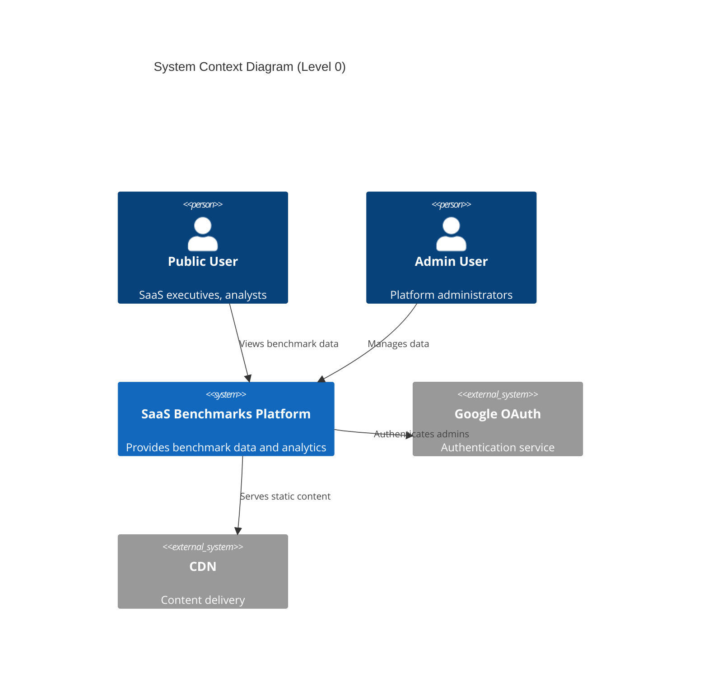
```mermaid
C4Context
    title System Context Diagram (Level 0)
    
    Person(user, "Public User", "SaaS executives, analysts")
    Person(admin, "Admin User", "Platform administrators")
    
    System(platform, "SaaS Benchmarks Platform", "Provides benchmark data and analytics")
    
    System_Ext(oauth, "Google OAuth", "Authentication service")
    System_Ext(cdn, "CDN", "Content delivery")
    
    Rel(user, platform, "Views benchmark data")
    Rel(admin, platform, "Manages data")
    Rel(platform, oauth, "Authenticates admins")
    Rel(platform, cdn, "Serves static content")
```

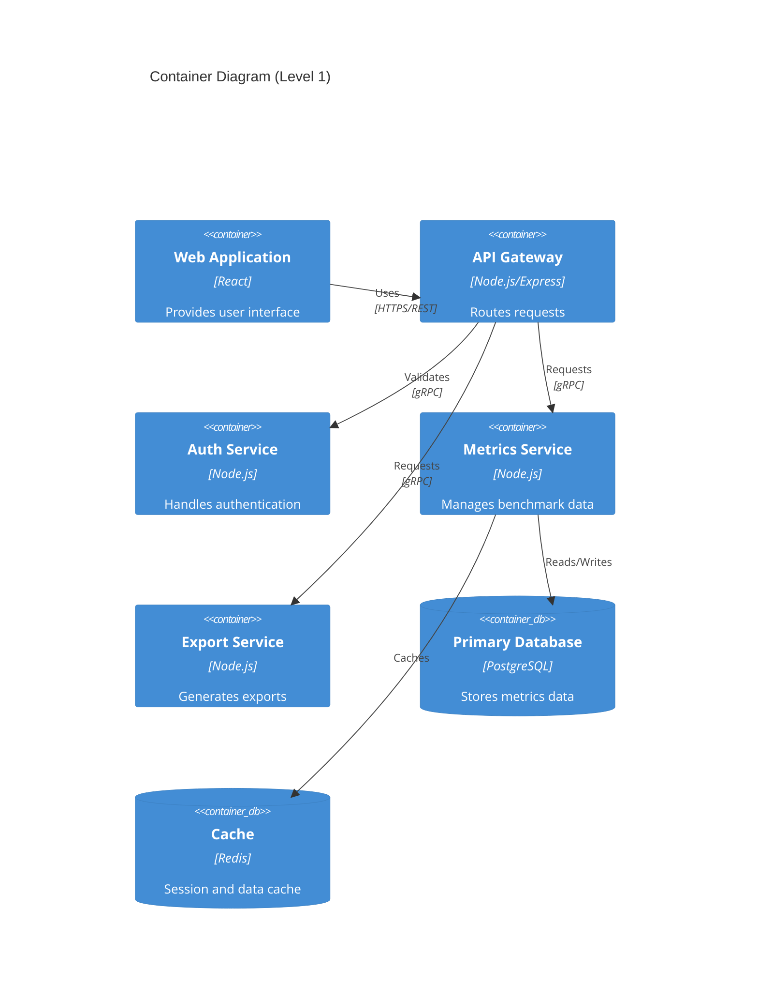
```mermaid
C4Container
    title Container Diagram (Level 1)
    
    Container(web, "Web Application", "React", "Provides user interface")
    Container(api, "API Gateway", "Node.js/Express", "Routes requests")
    Container(auth, "Auth Service", "Node.js", "Handles authentication")
    Container(metrics, "Metrics Service", "Node.js", "Manages benchmark data")
    Container(export, "Export Service", "Node.js", "Generates exports")
    
    ContainerDb(db, "Primary Database", "PostgreSQL", "Stores metrics data")
    ContainerDb(cache, "Cache", "Redis", "Session and data cache")
    
    Rel(web, api, "Uses", "HTTPS/REST")
    Rel(api, auth, "Validates", "gRPC")
    Rel(api, metrics, "Requests", "gRPC")
    Rel(api, export, "Requests", "gRPC")
    Rel(metrics, db, "Reads/Writes")
    Rel(metrics, cache, "Caches")
```

## 2.2 Component Details

### 2.2.1 Frontend Components

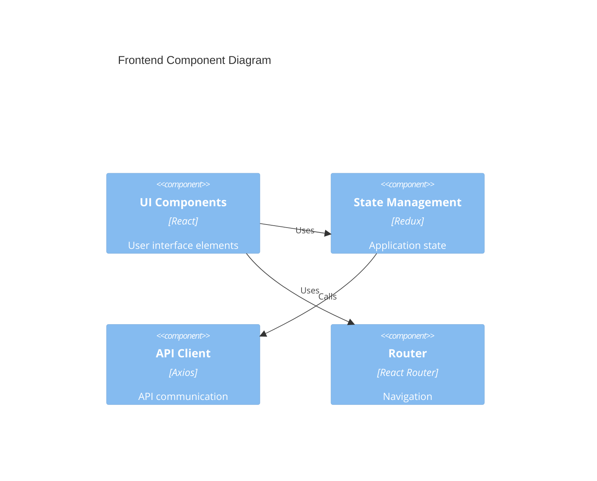
```mermaid
C4Component
    title Frontend Component Diagram
    
    Component(ui, "UI Components", "React", "User interface elements")
    Component(state, "State Management", "Redux", "Application state")
    Component(api_client, "API Client", "Axios", "API communication")
    Component(router, "Router", "React Router", "Navigation")
    
    Rel(ui, state, "Uses")
    Rel(state, api_client, "Calls")
    Rel(ui, router, "Uses")
```

### 2.2.2 Backend Services

| Service | Technology | Purpose | Scaling Strategy |
|---------|------------|---------|------------------|
| API Gateway | Node.js/Express | Request routing and validation | Horizontal with load balancer |
| Auth Service | Node.js | Authentication and authorization | Horizontal with session affinity |
| Metrics Service | Node.js | Benchmark data management | Horizontal with read replicas |
| Export Service | Node.js | Data export generation | Queue-based with auto-scaling |

## 2.3 Technical Decisions

### 2.3.1 Architecture Style

| Decision | Rationale |
|----------|-----------|
| Microservices | - Independent scaling of components<br>- Technology flexibility<br>- Isolated failure domains |
| Event-Driven | - Asynchronous data processing<br>- Loose coupling<br>- Better scalability |

### 2.3.2 Data Architecture

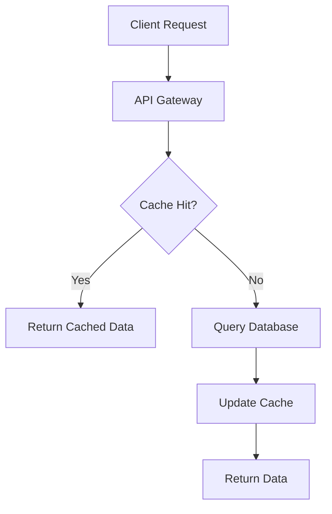
```mermaid
flowchart TD
    A[Client Request] --> B[API Gateway]
    B --> C{Cache Hit?}
    C -->|Yes| D[Return Cached Data]
    C -->|No| E[Query Database]
    E --> F[Update Cache]
    F --> G[Return Data]
```

## 2.4 Cross-Cutting Concerns

### 2.4.1 Monitoring and Observability

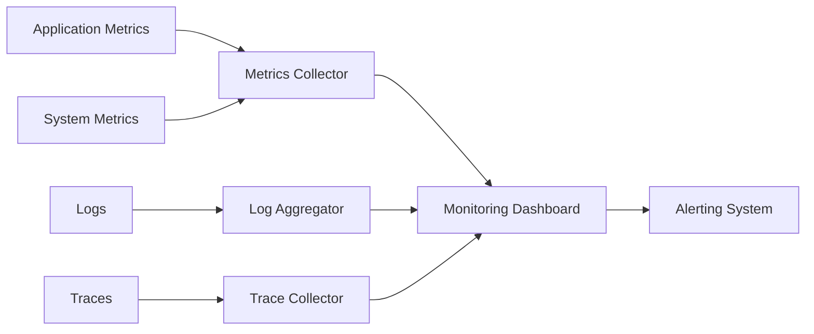
```mermaid
flowchart LR
    A[Application Metrics] --> B[Metrics Collector]
    C[System Metrics] --> B
    D[Logs] --> E[Log Aggregator]
    F[Traces] --> G[Trace Collector]
    
    B --> H[Monitoring Dashboard]
    E --> H
    G --> H
    
    H --> I[Alerting System]
```

### 2.4.2 Deployment Architecture

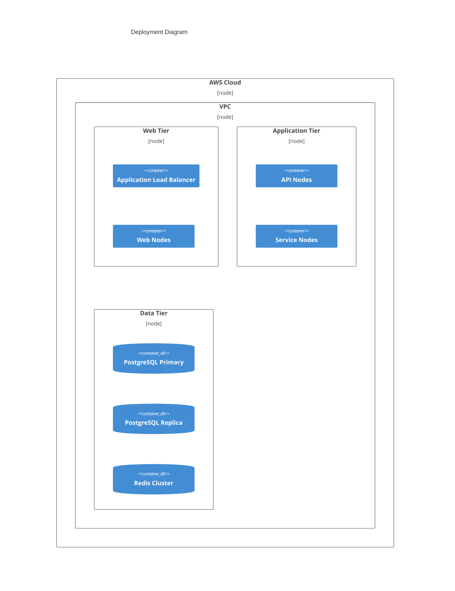
```mermaid
C4Deployment
    title Deployment Diagram
    
    Deployment_Node(aws, "AWS Cloud") {
        Deployment_Node(vpc, "VPC") {
            Deployment_Node(web_tier, "Web Tier") {
                Container(alb, "Application Load Balancer")
                Container(web_nodes, "Web Nodes")
            }
            
            Deployment_Node(app_tier, "Application Tier") {
                Container(api_nodes, "API Nodes")
                Container(service_nodes, "Service Nodes")
            }
            
            Deployment_Node(data_tier, "Data Tier") {
                ContainerDb(db_primary, "PostgreSQL Primary")
                ContainerDb(db_replica, "PostgreSQL Replica")
                ContainerDb(redis, "Redis Cluster")
            }
        }
    }
```

## 2.5 Security Architecture

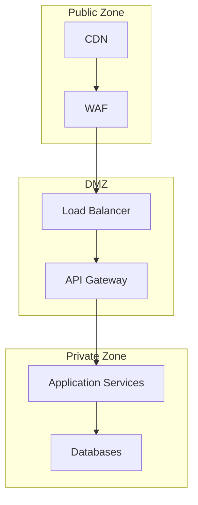
```mermaid
flowchart TD
    subgraph Public Zone
        A[CDN]
        B[WAF]
    end
    
    subgraph DMZ
        C[Load Balancer]
        D[API Gateway]
    end
    
    subgraph Private Zone
        E[Application Services]
        F[Databases]
    end
    
    A --> B
    B --> C
    C --> D
    D --> E
    E --> F
```

# 3. SYSTEM COMPONENTS ARCHITECTURE

## 3.1 USER INTERFACE DESIGN

### 3.1.1 Design Specifications

| Aspect | Requirements |
|--------|--------------|
| Visual Hierarchy | - Primary actions prominently displayed<br>- Clear data visualization hierarchy<br>- Consistent spacing and alignment<br>- Emphasis on metric values and percentiles |
| Component Library | - Material Design based system<br>- Custom data visualization components<br>- Reusable filter components<br>- Standardized form elements |
| Responsive Design | - Breakpoints: 320px, 768px, 1024px, 1440px<br>- Mobile-first approach<br>- Flexible grid system<br>- Collapsible navigation for mobile |
| Accessibility | - WCAG 2.1 Level AA compliance<br>- ARIA labels for interactive elements<br>- Keyboard navigation support<br>- Minimum contrast ratio 4.5:1 |
| Browser Support | - Chrome (latest 2 versions)<br>- Firefox (latest 2 versions)<br>- Safari (latest 2 versions)<br>- Edge (latest 2 versions) |

### 3.1.2 Interface Elements

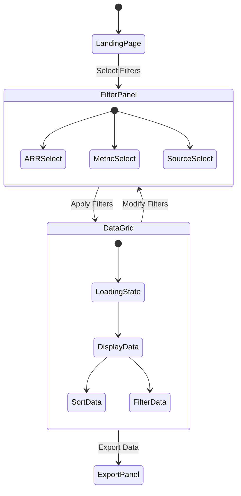
```mermaid
stateDiagram-v2
    [*] --> LandingPage
    LandingPage --> FilterPanel: Select Filters
    FilterPanel --> DataGrid: Apply Filters
    DataGrid --> ExportPanel: Export Data
    DataGrid --> FilterPanel: Modify Filters
    
    state FilterPanel {
        [*] --> ARRSelect
        [*] --> MetricSelect
        [*] --> SourceSelect
    }
    
    state DataGrid {
        [*] --> LoadingState
        LoadingState --> DisplayData
        DisplayData --> SortData
        DisplayData --> FilterData
    }
```

### 3.1.3 Critical User Flows

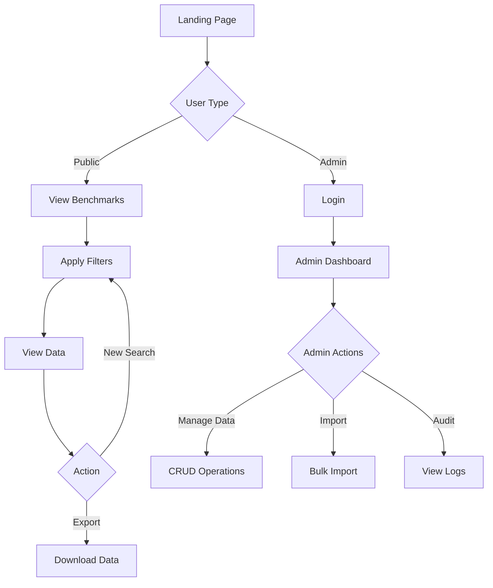
```mermaid
flowchart TD
    A[Landing Page] --> B{User Type}
    B -->|Public| C[View Benchmarks]
    B -->|Admin| D[Login]
    
    C --> E[Apply Filters]
    E --> F[View Data]
    F --> G{Action}
    G -->|Export| H[Download Data]
    G -->|New Search| E
    
    D --> I[Admin Dashboard]
    I --> J{Admin Actions}
    J -->|Manage Data| K[CRUD Operations]
    J -->|Import| L[Bulk Import]
    J -->|Audit| M[View Logs]
```

## 3.2 DATABASE DESIGN

### 3.2.1 Schema Design

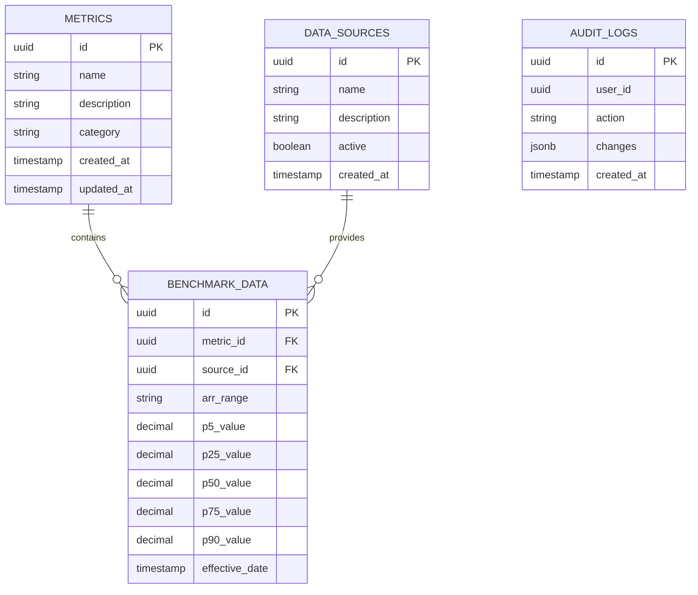
```mermaid
erDiagram
    METRICS {
        uuid id PK
        string name
        string description
        string category
        timestamp created_at
        timestamp updated_at
    }
    
    BENCHMARK_DATA {
        uuid id PK
        uuid metric_id FK
        uuid source_id FK
        string arr_range
        decimal p5_value
        decimal p25_value
        decimal p50_value
        decimal p75_value
        decimal p90_value
        timestamp effective_date
    }
    
    DATA_SOURCES {
        uuid id PK
        string name
        string description
        boolean active
        timestamp created_at
    }
    
    AUDIT_LOGS {
        uuid id PK
        uuid user_id
        string action
        jsonb changes
        timestamp created_at
    }
    
    METRICS ||--o{ BENCHMARK_DATA : contains
    DATA_SOURCES ||--o{ BENCHMARK_DATA : provides
```

### 3.2.2 Data Management Strategy

| Component | Strategy |
|-----------|----------|
| Partitioning | - Range partitioning by date for benchmark data<br>- List partitioning for audit logs |
| Indexing | - B-tree indexes on frequently queried columns<br>- Partial indexes for active records<br>- Composite indexes for common query patterns |
| Caching | - Redis for session data<br>- Materialized views for common queries<br>- Query result cache with 5-minute TTL |
| Backup | - Daily full backups<br>- Continuous WAL archiving<br>- 30-day retention period |

## 3.3 API DESIGN

### 3.3.1 API Architecture

| Component | Specification |
|-----------|--------------|
| Protocol | RESTful over HTTPS |
| Authentication | OAuth 2.0 with JWT |
| Rate Limiting | - 1000 requests/hour for public endpoints<br>- 5000 requests/hour for authenticated endpoints |
| Versioning | URI-based (/api/v1/) |
| Documentation | OpenAPI 3.0 specification |

### 3.3.2 API Endpoints

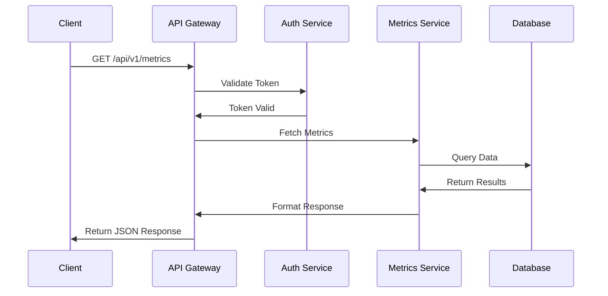
```mermaid
sequenceDiagram
    participant C as Client
    participant G as API Gateway
    participant A as Auth Service
    participant M as Metrics Service
    participant D as Database

    C->>G: GET /api/v1/metrics
    G->>A: Validate Token
    A->>G: Token Valid
    G->>M: Fetch Metrics
    M->>D: Query Data
    D->>M: Return Results
    M->>G: Format Response
    G->>C: Return JSON Response
```

### 3.3.3 Response Formats

```json
{
  "data": {
    "metrics": [{
      "id": "uuid",
      "name": "string",
      "percentiles": {
        "p5": "number",
        "p25": "number",
        "p50": "number",
        "p75": "number",
        "p90": "number"
      },
      "metadata": {
        "source": "string",
        "arrRange": "string",
        "lastUpdated": "timestamp"
      }
    }],
    "pagination": {
      "page": "number",
      "pageSize": "number",
      "totalItems": "number"
    }
  },
  "status": "string",
  "timestamp": "string"
}
```

# 4. TECHNOLOGY STACK

## 4.1 PROGRAMMING LANGUAGES

| Platform | Language | Version | Justification |
|----------|----------|---------|---------------|
| Backend | Node.js | 18.x LTS | - Event-driven architecture support<br>- Large ecosystem for microservices<br>- Excellent performance for API services |
| Frontend | TypeScript | 5.x | - Type safety for large-scale application<br>- Enhanced developer productivity<br>- Better maintainability |
| Database Scripts | Python | 3.11+ | - Robust data processing capabilities<br>- Rich statistical libraries<br>- Efficient ETL processing |
| DevOps | Go | 1.20+ | - Fast execution for automation tools<br>- Strong concurrency support<br>- Native cross-compilation |

## 4.2 FRAMEWORKS & LIBRARIES

### 4.2.1 Core Frameworks

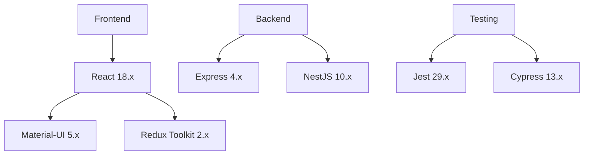
```mermaid
graph TD
    A[Frontend] --> B[React 18.x]
    B --> C[Material-UI 5.x]
    B --> D[Redux Toolkit 2.x]
    
    E[Backend] --> F[Express 4.x]
    E --> G[NestJS 10.x]
    
    H[Testing] --> I[Jest 29.x]
    H --> J[Cypress 13.x]
```

### 4.2.2 Supporting Libraries

| Category | Library | Version | Purpose |
|----------|---------|---------|----------|
| State Management | Redux Toolkit | 2.x | Centralized state management |
| API Client | Axios | 1.x | HTTP client with interceptors |
| Data Visualization | D3.js | 7.x | Custom chart rendering |
| Form Handling | React Hook Form | 7.x | Performant form validation |
| API Documentation | Swagger UI | 5.x | OpenAPI specification |
| Monitoring | OpenTelemetry | 1.x | Distributed tracing |

## 4.3 DATABASES & STORAGE

### 4.3.1 Database Architecture

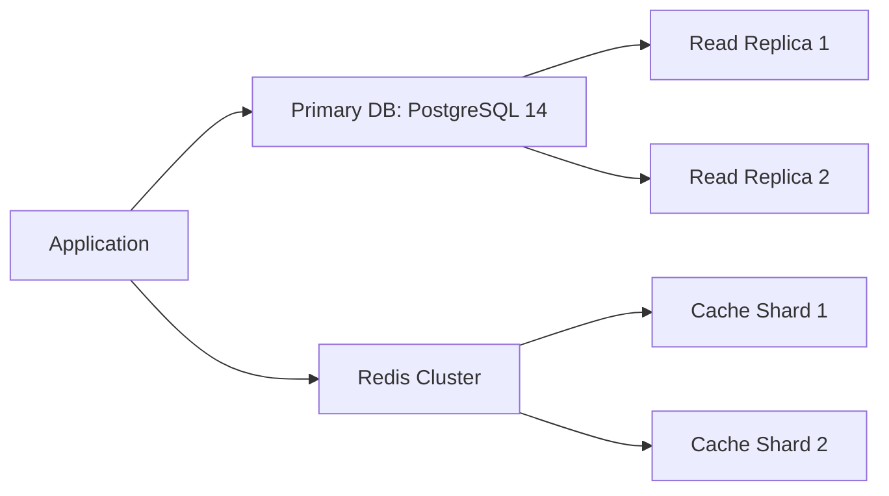
```mermaid
flowchart LR
    A[Application] --> B[Primary DB: PostgreSQL 14]
    B --> C[Read Replica 1]
    B --> D[Read Replica 2]
    A --> E[Redis Cluster]
    E --> F[Cache Shard 1]
    E --> G[Cache Shard 2]
```

### 4.3.2 Storage Solutions

| Type | Technology | Purpose | Configuration |
|------|------------|---------|---------------|
| Primary Database | PostgreSQL 14 | Transactional data | Multi-AZ deployment |
| Caching | Redis 7.x | Session & query cache | Cluster mode enabled |
| Object Storage | S3 | Export files & backups | Versioning enabled |
| Search | Elasticsearch 8.x | Audit log search | 3-node cluster |

## 4.4 THIRD-PARTY SERVICES

### 4.4.1 Service Integration

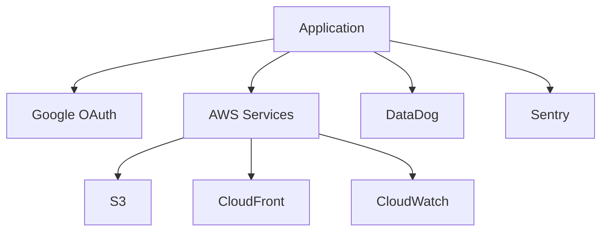
```mermaid
graph TD
    A[Application] --> B[Google OAuth]
    A --> C[AWS Services]
    C --> D[S3]
    C --> E[CloudFront]
    C --> F[CloudWatch]
    A --> G[DataDog]
    A --> H[Sentry]
```

### 4.4.2 Service Details

| Service | Provider | Purpose | SLA |
|---------|----------|---------|-----|
| Authentication | Google OAuth 2.0 | Admin authentication | 99.9% |
| CDN | CloudFront | Static asset delivery | 99.9% |
| Monitoring | DataDog | Application monitoring | 99.9% |
| Error Tracking | Sentry | Error reporting | 99.9% |
| Email | SES | System notifications | 99.9% |

## 4.5 DEVELOPMENT & DEPLOYMENT

### 4.5.1 Development Pipeline

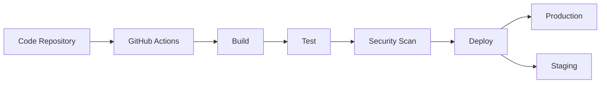
```mermaid
flowchart LR
    A[Code Repository] --> B[GitHub Actions]
    B --> C[Build]
    C --> D[Test]
    D --> E[Security Scan]
    E --> F[Deploy]
    F --> G[Production]
    F --> H[Staging]
```

### 4.5.2 Infrastructure Components

| Component | Technology | Version | Purpose |
|-----------|------------|---------|----------|
| Container Runtime | Docker | 24.x | Application containerization |
| Container Orchestration | ECS | Latest | Container management |
| Infrastructure as Code | Terraform | 1.5+ | Infrastructure provisioning |
| CI/CD | GitHub Actions | Latest | Automated deployment |
| Secrets Management | AWS Secrets Manager | Latest | Credential management |

# 5. SYSTEM DESIGN

## 5.1 USER INTERFACE DESIGN

### 5.1.1 Public Interface Layout

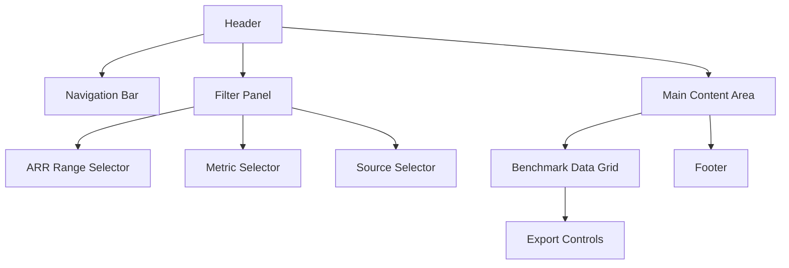
```mermaid
graph TD
    A[Header] --> B[Navigation Bar]
    A --> C[Filter Panel]
    C --> D[ARR Range Selector]
    C --> E[Metric Selector]
    C --> F[Source Selector]
    A --> G[Main Content Area]
    G --> H[Benchmark Data Grid]
    H --> I[Export Controls]
    G --> J[Footer]
```

### 5.1.2 Component Specifications

| Component | Specifications |
|-----------|----------------|
| Filter Panel | - Fixed left sidebar<br>- Collapsible sections<br>- Sticky positioning<br>- Mobile-responsive drawer |
| Data Grid | - Sortable columns<br>- Fixed header<br>- Horizontal scroll for mobile<br>- Row highlighting |
| Export Panel | - Floating action button<br>- Format selection dropdown<br>- Progress indicator |
| Navigation | - Responsive menu<br>- Breadcrumb navigation<br>- Search functionality |

### 5.1.3 Admin Interface Layout

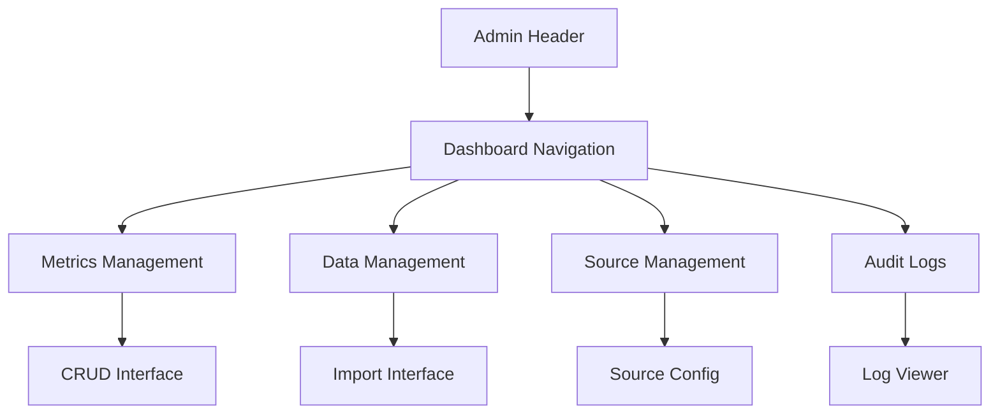
```mermaid
graph TD
    A[Admin Header] --> B[Dashboard Navigation]
    B --> C[Metrics Management]
    B --> D[Data Management]
    B --> E[Source Management]
    B --> F[Audit Logs]
    C --> G[CRUD Interface]
    D --> H[Import Interface]
    E --> I[Source Config]
    F --> J[Log Viewer]
```

## 5.2 DATABASE DESIGN

### 5.2.1 Schema Design

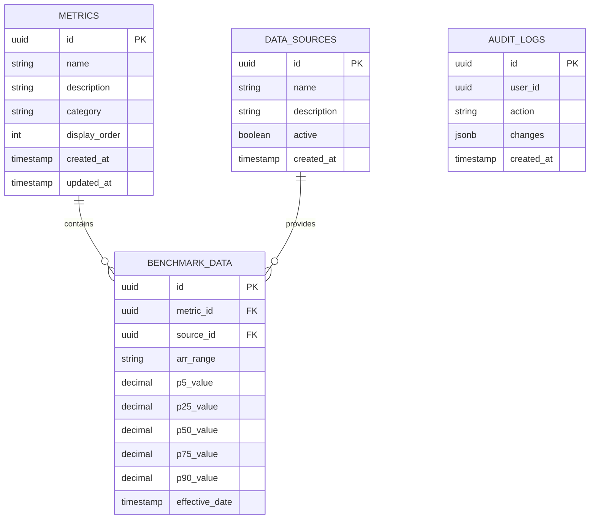
```mermaid
erDiagram
    METRICS {
        uuid id PK
        string name
        string description
        string category
        int display_order
        timestamp created_at
        timestamp updated_at
    }
    
    BENCHMARK_DATA {
        uuid id PK
        uuid metric_id FK
        uuid source_id FK
        string arr_range
        decimal p5_value
        decimal p25_value
        decimal p50_value
        decimal p75_value
        decimal p90_value
        timestamp effective_date
    }
    
    DATA_SOURCES {
        uuid id PK
        string name
        string description
        boolean active
        timestamp created_at
    }
    
    AUDIT_LOGS {
        uuid id PK
        uuid user_id
        string action
        jsonb changes
        timestamp created_at
    }
    
    METRICS ||--o{ BENCHMARK_DATA : contains
    DATA_SOURCES ||--o{ BENCHMARK_DATA : provides
```

### 5.2.2 Indexing Strategy

| Table | Index Type | Columns | Purpose |
|-------|------------|---------|----------|
| BENCHMARK_DATA | B-tree | (metric_id, arr_range, effective_date) | Filtering queries |
| BENCHMARK_DATA | B-tree | (source_id, effective_date) | Source-based queries |
| METRICS | B-tree | (category, display_order) | Category filtering |
| AUDIT_LOGS | BRIN | (created_at) | Time-based queries |

## 5.3 API DESIGN

### 5.3.1 REST Endpoints

| Endpoint | Method | Purpose | Request Format | Response Format |
|----------|--------|---------|----------------|-----------------|
| /api/v1/metrics | GET | List metrics | Query params | JSON array |
| /api/v1/metrics/{id} | GET | Get metric details | Path param | JSON object |
| /api/v1/benchmarks | GET | Get benchmark data | Query params | JSON array |
| /api/v1/sources | GET | List data sources | Query params | JSON array |
| /api/v1/export | POST | Generate export | JSON body | File stream |

### 5.3.2 API Flow

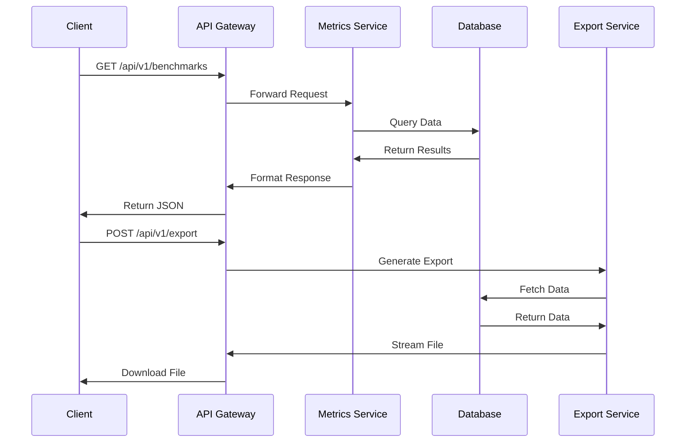
```mermaid
sequenceDiagram
    participant C as Client
    participant G as API Gateway
    participant M as Metrics Service
    participant D as Database
    participant E as Export Service
    
    C->>G: GET /api/v1/benchmarks
    G->>M: Forward Request
    M->>D: Query Data
    D->>M: Return Results
    M->>G: Format Response
    G->>C: Return JSON
    
    C->>G: POST /api/v1/export
    G->>E: Generate Export
    E->>D: Fetch Data
    D->>E: Return Data
    E->>G: Stream File
    G->>C: Download File
```

### 5.3.3 Response Format

```json
{
  "data": {
    "metrics": [{
      "id": "uuid",
      "name": "string",
      "percentiles": {
        "p5": "number",
        "p25": "number",
        "p50": "number",
        "p75": "number",
        "p90": "number"
      },
      "metadata": {
        "source": "string",
        "arrRange": "string",
        "lastUpdated": "timestamp"
      }
    }],
    "pagination": {
      "page": "number",
      "pageSize": "number",
      "totalItems": "number"
    }
  },
  "status": "success",
  "timestamp": "ISO8601"
}
```

### 5.3.4 Error Handling

| Error Code | Description | Response Format |
|------------|-------------|-----------------|
| 400 | Bad Request | JSON with error details |
| 401 | Unauthorized | JSON with auth error |
| 403 | Forbidden | JSON with permission error |
| 404 | Not Found | JSON with resource details |
| 500 | Server Error | JSON with error reference |

# 6. USER INTERFACE DESIGN

## 6.1 Common Elements

### Symbol Key
```
Icons:
[?] - Help/tooltip
[$] - Financial data
[i] - Information
[+] - Add/create new
[x] - Close/remove
[<] [>] - Navigation
[^] - Upload data
[#] - Menu/dashboard
[@] - User/admin
[!] - Warning/error
[=] - Settings
[*] - Important/featured

Interactive Elements:
[ ] - Checkbox
( ) - Radio button
[Button] - Clickable button
[...] - Text input field
[====] - Progress bar
[v] - Dropdown menu
```

## 6.2 Public Interface

### 6.2.1 Main Dashboard
```
+----------------------------------------------------------+
|  SaaS Benchmarks [#]                          [@] Admin   |
+----------------------------------------------------------+
|                                                           |
|  +----------------+  +-------------------------------+    |
|  | Filter Panel   |  | Benchmark Data             [?]|    |
|  | +------------+ |  |                               |    |
|  | | ARR Range  | |  | +---------------------------+|    |
|  | | [v]        | |  | | Metric Name    | Values   ||    |
|  | +------------+ |  | +---------------------------+|    |
|  |              | |  | | Revenue Growth | P90: 150%||    |
|  | +------------+ |  | |               | P75: 120%||    |
|  | | Metrics    | |  | |               | P50: 80% ||    |
|  | | [ ] Growth | |  | |               | P25: 50% ||    |
|  | | [ ] Sales  | |  | |               | P5:  20% ||    |
|  | | [ ] Finance| |  | +---------------------------+|    |
|  | +------------+ |  |                               |    |
|  |              | |  | [Export to CSV]   [Reset]     |    |
|  | +------------+ |  |                               |    |
|  | | Sources    | |  +-------------------------------+    |
|  | | [ ] Src A  | |                                      |
|  | | [ ] Src B  | |                                      |
|  | +------------+ |                                      |
|  +----------------+                                      |
|                                                         |
+----------------------------------------------------------+
```

### 6.2.2 Export Dialog
```
+----------------------------------+
|  Export Benchmark Data        [x] |
+----------------------------------+
|                                  |
|  Select Format:                  |
|  (•) CSV                        |
|  ( ) Excel                      |
|                                  |
|  Include:                        |
|  [x] Selected metrics only       |
|  [ ] All metrics                 |
|  [x] Percentile breakdowns       |
|                                  |
|  [==========] 100%              |
|                                  |
|  [Download]      [Cancel]        |
+----------------------------------+
```

## 6.3 Administrative Interface

### 6.3.1 Admin Dashboard
```
+----------------------------------------------------------+
|  Admin Dashboard [#]                    [@] Admin  [=]     |
+----------------------------------------------------------+
|                                                           |
|  +----------------+  +--------------------------------+   |
|  | Quick Actions  |  | Recent Activity              [i]|  |
|  | [+] Add Metric |  | • Updated Growth Rate metrics    |  |
|  | [^] Import Data|  | • Added new data source         |  |
|  | [!] Alerts     |  | • Imported Q2 benchmarks        |  |
|  +----------------+  +--------------------------------+   |
|                                                           |
|  +----------------+  +--------------------------------+   |
|  | Data Sources   |  | System Status               [!]|  |
|  | • Source A [*] |  | Database: [====] OK             |  |
|  | • Source B     |  | Cache:    [====] OK             |  |
|  | • Source C     |  | API:      [====] Warning        |  |
|  +----------------+  +--------------------------------+   |
|                                                           |
+----------------------------------------------------------+
```

### 6.3.2 Metric Management
```
+----------------------------------------------------------+
|  Manage Metrics [#]                     [@] Admin  [=]     |
+----------------------------------------------------------+
|  [+ Add New Metric]                    [Search...]         |
|                                                           |
|  +--------------------------------------------------+    |
|  | Metric Name    | Category  | Last Updated | Action |    |
|  +--------------------------------------------------+    |
|  | Revenue Growth | Financial | 2023-10-01   | [Edit] |    |
|  |               |           |              | [x]    |    |
|  +--------------------------------------------------+    |
|  | NDR           | Growth    | 2023-10-01   | [Edit] |    |
|  |               |           |              | [x]    |    |
|  +--------------------------------------------------+    |
|  | Magic Number  | Sales     | 2023-09-28   | [Edit] |    |
|  |               |           |              | [x]    |    |
|  +--------------------------------------------------+    |
|                                                           |
|  [< Previous]                              [Next >]       |
+----------------------------------------------------------+
```

### 6.3.3 Data Import
```
+----------------------------------------------------------+
|  Import Benchmark Data [#]               [@] Admin  [=]     |
+----------------------------------------------------------+
|                                                           |
|  Step 1: Select Data Source                               |
|  [v] Source A                                             |
|                                                           |
|  Step 2: Upload File                                      |
|  [Drop CSV file here or click to upload]                  |
|  [^ Upload]                                               |
|                                                           |
|  Step 3: Validate                                         |
|  +--------------------------------------------------+    |
|  | Field         | Status                | Action    |    |
|  +--------------------------------------------------+    |
|  | Metric IDs    | [====] Valid          | [Review]  |    |
|  | Date Format   | [====] Valid          | [Review]  |    |
|  | Values        | [==  ] 2 Errors       | [Fix]     |    |
|  +--------------------------------------------------+    |
|                                                           |
|  [Cancel]                                [Import Data]    |
+----------------------------------------------------------+
```

## 6.4 Responsive Design Breakpoints

| Breakpoint | Width | Layout Changes |
|------------|-------|----------------|
| Mobile | < 768px | - Filter panel becomes drawer menu<br>- Single column layout<br>- Condensed data tables |
| Tablet | 768px - 1024px | - Filter panel as left sidebar<br>- Two column layout<br>- Scrollable data tables |
| Desktop | > 1024px | - Fixed filter panel<br>- Full layout<br>- Expanded data tables |

## 6.5 Component Specifications

### 6.5.1 Filter Panel
- Fixed position on desktop, drawer on mobile
- Collapsible sections with smooth animations
- Real-time filter updates
- Clear all filters button
- Filter count indicator

### 6.5.2 Data Grid
- Fixed header on scroll
- Sortable columns
- Row hover states
- Pagination controls
- Export button in header
- Loading state indicator

### 6.5.3 Admin Controls
- Confirmation dialogs for destructive actions
- Inline editing capabilities
- Bulk action support
- Error state handling
- Success/failure notifications

# 7. SECURITY CONSIDERATIONS

## 7.1 AUTHENTICATION AND AUTHORIZATION

### 7.1.1 Authentication Flow

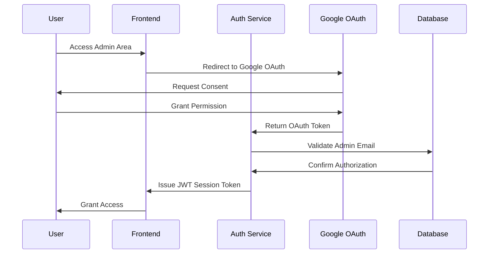
```mermaid
sequenceDiagram
    participant U as User
    participant F as Frontend
    participant A as Auth Service
    participant G as Google OAuth
    participant D as Database
    
    U->>F: Access Admin Area
    F->>G: Redirect to Google OAuth
    G->>U: Request Consent
    U->>G: Grant Permission
    G->>A: Return OAuth Token
    A->>D: Validate Admin Email
    D->>A: Confirm Authorization
    A->>F: Issue JWT Session Token
    F->>U: Grant Access
```

### 7.1.2 Authorization Matrix

| Role | Data Access | Administrative Functions | System Configuration |
|------|-------------|------------------------|---------------------|
| Public User | Read-only benchmark data | None | None |
| Admin | Full read access | CRUD operations on metrics and sources | None |
| System Admin | Full read access | Full CRUD operations | System configuration access |

## 7.2 DATA SECURITY

### 7.2.1 Data Protection Measures

| Layer | Security Measure | Implementation |
|-------|-----------------|----------------|
| Transport | TLS 1.3 | All API endpoints and database connections |
| Storage | AES-256 encryption | Sensitive database fields |
| Application | Input sanitization | Express middleware validation |
| Cache | Encrypted Redis store | Session data and temporary storage |
| Backup | Encrypted snapshots | Daily automated backups |

### 7.2.2 Data Access Controls

```mermaid
flowchart TD
    A[Request] --> B{Authentication}
    B -->|Invalid| C[Deny Access]
    B -->|Valid| D{Authorization}
    D -->|Unauthorized| C
    D -->|Authorized| E{Rate Limiting}
    E -->|Exceeded| F[Rate Limit Error]
    E -->|Within Limits| G[Grant Access]
    G --> H{Data Classification}
    H -->|Public| I[Direct Access]
    H -->|Sensitive| J[Encrypted Access]
```

## 7.3 SECURITY PROTOCOLS

### 7.3.1 Security Headers

| Header | Value | Purpose |
|--------|--------|---------|
| Strict-Transport-Security | max-age=31536000; includeSubDomains | Enforce HTTPS |
| Content-Security-Policy | default-src 'self'; script-src 'self' *.googleapis.com | Prevent XSS |
| X-Frame-Options | DENY | Prevent clickjacking |
| X-Content-Type-Options | nosniff | Prevent MIME sniffing |
| X-XSS-Protection | 1; mode=block | Additional XSS protection |

### 7.3.2 Security Monitoring

```mermaid
flowchart LR
    A[Security Events] --> B[Event Collector]
    B --> C{Event Type}
    C -->|Authentication| D[Auth Monitor]
    C -->|Access| E[Access Monitor]
    C -->|Attack| F[Threat Monitor]
    
    D --> G[Alert System]
    E --> G
    F --> G
    
    G --> H[Security Team]
    G --> I[Automated Response]
```

### 7.3.3 Security Compliance Measures

| Category | Measure | Implementation |
|----------|---------|----------------|
| Session Management | 30-minute timeout | Redis session store with expiration |
| Password Policy | OAuth only | Google authentication standards |
| API Security | Rate limiting | 1000 requests/hour per IP |
| Audit Logging | Comprehensive logging | All security events and admin actions |
| Vulnerability Scanning | Weekly automated scans | Node.js dependencies and application code |
| Penetration Testing | Quarterly tests | Third-party security assessment |

### 7.3.4 Incident Response

```mermaid
stateDiagram-v2
    [*] --> Detection
    Detection --> Analysis
    Analysis --> Containment
    Containment --> Eradication
    Eradication --> Recovery
    Recovery --> PostIncident
    PostIncident --> [*]
    
    state PostIncident {
        [*] --> Review
        Review --> Update
        Update --> Documentation
        Documentation --> [*]
    }
```

# 8. INFRASTRUCTURE

## 8.1 DEPLOYMENT ENVIRONMENT

```mermaid
flowchart TD
    subgraph Production Environment
        A[AWS Cloud] --> B[VPC]
        B --> C[Public Subnets]
        B --> D[Private Subnets]
        C --> E[Load Balancers]
        D --> F[Application Tier]
        D --> G[Database Tier]
    end
    
    subgraph Staging Environment
        H[AWS Cloud] --> I[VPC]
        I --> J[Staging Services]
    end
    
    subgraph Development
        K[Local Development]
        L[CI/CD Pipeline]
    end
```

| Environment | Purpose | Configuration |
|-------------|---------|---------------|
| Production | Live system serving users | Multi-AZ, High Availability |
| Staging | Pre-production testing | Single-AZ, Scaled-down |
| Development | Local development | Docker Compose based |

## 8.2 CLOUD SERVICES

| Service | Purpose | Configuration |
|---------|---------|---------------|
| AWS ECS | Container orchestration | Fargate launch type |
| AWS RDS | PostgreSQL database | Multi-AZ, Auto-scaling |
| AWS ElastiCache | Redis caching | Cluster mode enabled |
| AWS CloudFront | CDN for static assets | Global edge locations |
| AWS Route 53 | DNS management | Latency-based routing |
| AWS CloudWatch | Monitoring and logging | Custom metrics enabled |
| AWS Secrets Manager | Credentials management | Automatic rotation |

## 8.3 CONTAINERIZATION

```mermaid
graph TD
    subgraph Container Architecture
        A[Base Image] --> B[Node.js Runtime]
        B --> C[Application Code]
        C --> D[Service Container]
        
        E[Redis Base] --> F[Cache Container]
        
        G[Nginx Base] --> H[Web Server Container]
    end
```

| Component | Image | Version | Purpose |
|-----------|-------|---------|----------|
| Base Image | node | 18-alpine | Minimal Node.js runtime |
| Web Server | nginx | 1.24-alpine | Static file serving |
| Cache | redis | 7.0-alpine | Session storage |
| Database | postgres | 14-alpine | Data persistence |

## 8.4 ORCHESTRATION

```mermaid
flowchart LR
    subgraph ECS Cluster
        A[Service Discovery]
        B[Task Definitions]
        C[Services]
        
        B --> C
        C --> A
    end
    
    subgraph Auto Scaling
        D[Target Tracking]
        E[Step Scaling]
    end
    
    C --> D
    C --> E
```

| Component | Configuration | Scaling Policy |
|-----------|---------------|----------------|
| API Service | 2-8 tasks | CPU utilization > 70% |
| Web Service | 2-6 tasks | Request count based |
| Worker Service | 1-4 tasks | Queue length based |
| Cache Cluster | 2 nodes | Manual scaling |

## 8.5 CI/CD PIPELINE

```mermaid
flowchart LR
    A[GitHub Repository] --> B[GitHub Actions]
    B --> C{Tests Pass?}
    C -->|Yes| D[Build Images]
    C -->|No| E[Notify Team]
    D --> F[Push to ECR]
    F --> G{Branch?}
    G -->|Main| H[Deploy to Staging]
    G -->|Production| I[Deploy to Production]
    H --> J[Integration Tests]
    J -->|Pass| K[Promote to Production]
```

| Stage | Tools | Actions |
|-------|-------|---------|
| Source Control | GitHub | Feature branch workflow |
| CI Pipeline | GitHub Actions | Build, test, security scan |
| Container Registry | AWS ECR | Image versioning |
| Deployment | AWS CodeDeploy | Blue-green deployment |
| Monitoring | CloudWatch | Performance metrics |
| Notifications | SNS | Deployment status alerts |

### Deployment Process

| Step | Description | Rollback Strategy |
|------|-------------|------------------|
| Build | Create container images | Retain previous images |
| Test | Run unit and integration tests | Fail fast principle |
| Security Scan | Check for vulnerabilities | Block deployment on high severity |
| Deploy Staging | Update staging environment | Automatic rollback on failure |
| Integration Test | Run E2E tests | Manual intervention |
| Deploy Production | Blue-green deployment | Automatic fallback to blue |
| Verify | Health check and metrics | Manual rollback if needed |

# 9. APPENDICES

## 9.1 ADDITIONAL TECHNICAL INFORMATION

### 9.1.1 Browser Support Matrix

| Browser | Minimum Version | Notes |
|---------|----------------|--------|
| Chrome | Latest 2 versions | Primary development target |
| Firefox | Latest 2 versions | Full feature support |
| Safari | Latest 2 versions | iOS optimization required |
| Edge | Latest 2 versions | Progressive enhancement |

### 9.1.2 Performance Metrics Tracking

```mermaid
flowchart TD
    A[Performance Events] --> B{Metric Type}
    B -->|Page Load| C[Core Web Vitals]
    B -->|API| D[Response Times]
    B -->|Database| E[Query Times]
    
    C --> F[Monitoring Dashboard]
    D --> F
    E --> F
    
    F --> G[Alert System]
    F --> H[Performance Reports]
```

## 9.2 GLOSSARY

| Term | Definition |
|------|------------|
| Core Web Vitals | Google's metrics for web performance including LCP, FID, and CLS |
| Data Source | An authenticated provider of SaaS benchmark data |
| Percentile Distribution | Statistical representation of metric values across different performance levels |
| Role-Based Access | Security model restricting system access based on user roles |
| Blue-Green Deployment | Deployment strategy using two identical environments for zero-downtime updates |
| Materialized View | Database object containing precomputed query results |
| Connection Pooling | Technique for sharing and reusing database connections |
| Hot Standby | Secondary system ready to take over operations immediately |

## 9.3 ACRONYMS

| Acronym | Definition |
|---------|------------|
| AJAX | Asynchronous JavaScript and XML |
| ARR | Annual Recurring Revenue |
| CDN | Content Delivery Network |
| CLS | Cumulative Layout Shift |
| CORS | Cross-Origin Resource Sharing |
| CPU | Central Processing Unit |
| CRUD | Create, Read, Update, Delete |
| CSP | Content Security Policy |
| DNS | Domain Name System |
| FID | First Input Delay |
| GDPR | General Data Protection Regulation |
| HTTP | Hypertext Transfer Protocol |
| HTTPS | Hypertext Transfer Protocol Secure |
| JSON | JavaScript Object Notation |
| JWT | JSON Web Token |
| KPI | Key Performance Indicator |
| LCP | Largest Contentful Paint |
| MIME | Multipurpose Internet Mail Extensions |
| OAuth | Open Authorization |
| REST | Representational State Transfer |
| SaaS | Software as a Service |
| SQL | Structured Query Language |
| SSL | Secure Sockets Layer |
| TCP | Transmission Control Protocol |
| TLS | Transport Layer Security |
| TTL | Time To Live |
| UI | User Interface |
| URL | Uniform Resource Locator |
| UTC | Coordinated Universal Time |
| UUID | Universally Unique Identifier |
| VPC | Virtual Private Cloud |
| WAF | Web Application Firewall |
| XSS | Cross-Site Scripting |